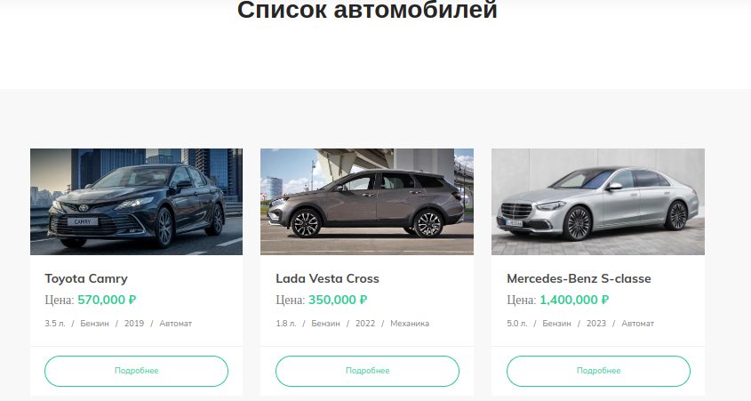
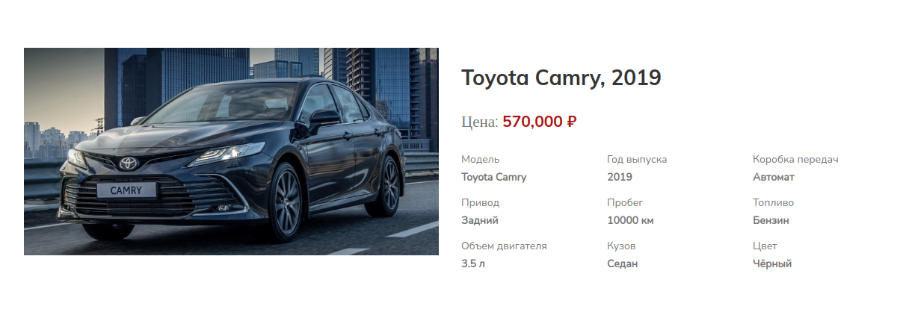
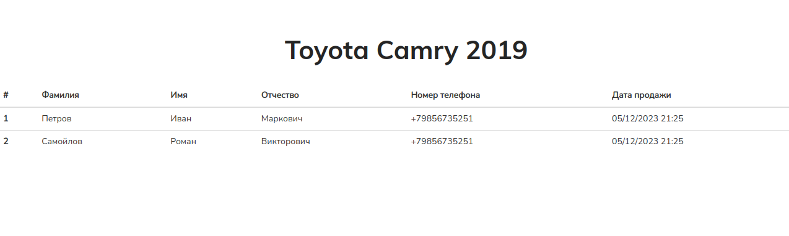

# Реализуем онлайн-автосалон

## Цели домашнего задания

1. Научиться подключать необходимую БД к проекту
2. Научиться создавать модели и задавать правильные типы полям
3. Познакомиться с механизмом миграций
4. Закрепить навыки работы с административной панелью
5. Рассмотреть варианты выполнения запросов при помощи ORM
6. Ознакомиться с передачей результатов запроса в шаблоны

## Задание

Необходимо реализовать небольшой сайт автосалона. Сайт будет состоять из 3 страниц: 

- `/cars/` - список всех автомобилей
- `/cars/<id_авто>/` - детальная информация о конкретном авто
- `/cars/<id_авто>/sales/` - статистика продаж по конкретному автомобилю

## Реализация


### БД

Создайте базу данных, подключите её к проекту и примените миграции для создания таблиц.

### Модели

В модуле `models.py` нашего приложения уже есть модель `Client` (данные покупателя). 

Вам же необходимо создать модель `Car` с полями: 
- `id` - первичный ключ 
- `model` - модель авто
- `year` - год выпуска 
- `color` - цвет
- `mileage` - пробег
- `volume` - объём двигателя
- `body_type` - тип кузова, варианты возможных значений взять из **BODY_TYPE_CHOICES**
- `drive_unit` - привод, варианты возможных значений взять из **DRIVE_UNIT_CHOICES**
- `gearbox` - коробка передач, варианты возможных значений взять из **GEARBOX_CHOICES**
- `fuel_type` - тип топлива, варианты возможных значений взять из **FUEL_TYPE_CHOICES**
- `price` - цена
- `image` - изображение авто, сами картинки можно взять в папке **[images](../images)**

Также необходимо создать модель `Sale` (продажа автомобиля), в которой будут следующие поля:

- `id` - первичный ключ
- `client` - связка с моделью ***Client***
- `car` - связка с моделью Car
- `created_at` - дата и время продажи, для автозаполнения добавьте свойство ***auto_now_add=True***

после описания моделей создайте миграции и примените их.

### Административная панель

Зарегистирируйте созданные модели в админ панели и создайте записи в БД. Изображения автомобилей можно взять в папке `images`.

### Запросы

Необходимо реализовать контроллеры 3 страниц:

- список авто
- детали авто
- продажи по конкретному авто

HTML шаблоны страниц уже реализованы, внимательно их изучите и корректно реализуйте логику вьюшек.

## Ожидаемый результат

### список авто



### детали авто



### продажи авто



## Критерии оценки

Для получения зачёта по данному заданию необходимо выполнить следующие пункты:
- подключите БД к проекту
- создайте модели, используя подходящие типы полей
- выполните миграции
- зарегистируйте модели в административной панели
- реализуйте вьюшки

## Доп задание

В шаблоне `list.html` есть закомментированная форма поиска, она передаёт в список авто параметр `q`. 

Реализуйте поиск авто по модели авто, используя значение этого параметра.

## Документация по проекту

Для запуска проекта необходимо

Установить зависимости:
```commandline
pip install -r requirements.txt
```

Выполнить следующие команды:

- Команда для применения миграций для базы данных

```commandline
python manage.py migrate
```

- Команда для запуска приложения

```commandline
python manage.py runserver
```

- При создании моделей или их изменении необходимо выполнить следующие команды:

```commandline
python manage.py makemigrations
python manage.py migrate
```